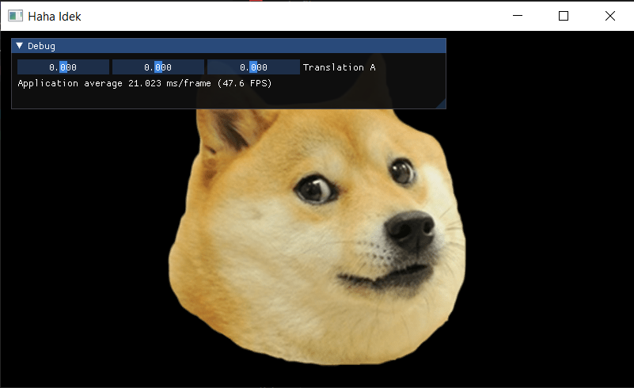

# GL-ImageRenderer
An Image-Renderer made with OpenGL by following [The Cherno's OpenGL tutorial](https://www.youtube.com/playlist?list=PLlrATfBNZ98foTJPJ_Ev03o2oq3-GGOS2).\


## Usage
Download the .exe from [here](https://github.com/HmsGoBrr/GL-ImageRenderer/releases).<br>
Then use this command (in Command Prompt) to open an image (.png)
```
path/to/glir.exe <image file path>;
```

## Build Instructions
To manually build the program, first you need to create "bin" subfolder inside the folder:
```
mkdir bin
```
Then run the Makefile:
```
make          # for UNIX-based systems
mingw32-make  # for Windows (mingw)
```
The output should be in the "bin" folder. After that you can run the program normally, like so:
```
bin/glir <image file path>
```
